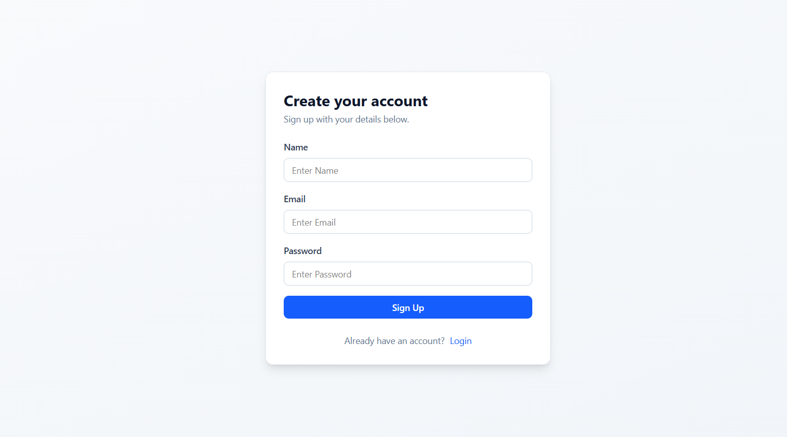

# 🔗 URL Shortener

A full-stack web application that converts long URLs into short, shareable links.  
Built with a scalable backend and a clean, responsive frontend, this project demonstrates core backend logic, database integration, and REST API handling.

---

## 📌 Project Overview

The URL Shortener allows users to:

- Convert long URLs into short, unique links
- Redirect users from short link to original URL
- Store and manage URLs in a database
- Handle invalid or duplicate entries efficiently

This project demonstrates backend routing, database schema design, API creation, and frontend-backend integration.

---

## 🖼 Screenshots

### 📍 Screenshot 1 – Home Page

---

### 📍 Screenshot 2 – SignUp/Login

---

### 📍 Screenshot 3 – Shortened URL Generated / Analytics Page

---

## 🚀 Tech Stack

### 🖥 Frontend
- React.js (or HTML/CSS/JS)
- Axios (for API requests)
- Responsive UI Design

### 🌐 Backend
- Node.js
- Express.js
- REST APIs

### 🗄 Database
- MongoDB
- Mongoose

---

## ⚙️ Features

✅ User Authentication (Login & Signup)  
✅ Generate unique short URLs 
✅ Automatic redirection to original link  
✅ Input validation  
✅ Error handling  
✅ Database storage  
✅ Clean UI  
✅ Click Tracking & Analytics Dashboard  
✅ Link Expiration Feature

---

## 🧠 How It Works

1. User enters a long URL.
2. Backend generates a unique short ID.
3. Short URL is stored in database.
4. When user visits short URL:
   - Server searches database
   - Redirects to original URL

---

## 📂 Project Structure

URL_Shortener/
│
├── frontend/
├── backend/
├── models/
├── routes/
└── README.md

---

## 🛠 Installation & Setup

### 1️⃣ Clone the Repository
- git clone https://github.com/your-username/url-shortener.git

### 2️⃣ Install Dependencies

##### Backend:
- cd backend
- npm install
- npm run dev

##### Frontend:

- cd frontend
- npm install
- npm start

---

## 🔮 Future Improvements
🛡 Rate Limiting & Security Enhancements  
📱 QR Code Generation for Short Links  

---

## 🌟 Learning Outcomes

- REST API development
- MongoDB schema design
- Unique ID generation logic
- HTTP redirection handling
- Full-stack project structure

---

## 👨‍💻 Author

**Saumay Gupta**

---

⭐ If you found this project useful, consider giving it a star!
